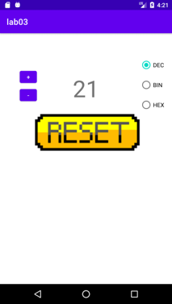

# Exercise 3-1

Create an application with the following features:

1. Create an application using the previous lab `Counter` class (code reusing).
2. The counter value should be shown in large font, the "Reset" button must be an image (name must start with letters only) and there should be a `RadioGroup` containing three `RadioButto` widgets. These buttons control whether the counter value is displayed in binary, decimal or hexadecimal format.

**NB!** Remember not to write Integer values to a `TextView`.

### Expected layout

### Useful resources

- [Layouts](https://developer.android.com/guide/topics/ui/declaring-layout)
- [Build a UI with Layout Editor](https://developer.android.com/studio/write/layout-editor)
