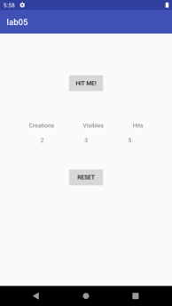

# Exercise 5-1

Create an application with the following features:

1. Use `Log.d()` method to log (to the logcat output) when a call to the following methods is made: `onCreate()`, `onStart()`, `onResume()`, `onPause()`, `onStop()`, `onRestart()` and `onDestroy()`.
2. Create three Counters (use `Counter.java` from the previous exercises, and don't modify it at all) to count how many times `onCreate()` and `onStart()` methods have been called, and how many times the "Hit Me!" button has been pressed.
3. Create a "Reset" button which resets all counters to zero.
4. The values of these counters must be saved to the `SharedPreferences` on the `onPause()` method and retrieved from the `SharedPreferences` on the `onCreate()` method.

**NB!** Make sure that the values of the counters are preserved even if you close the application.

### Expected layout

### Useful resources

- [Understand the Activity Lifecycle](https://developer.android.com/guide/components/activities/activity-lifecycle)
- [Data and file storage overview](https://developer.android.com/training/data-storage)
- [Save key-value data](https://developer.android.com/training/data-storage/shared-preferences)
